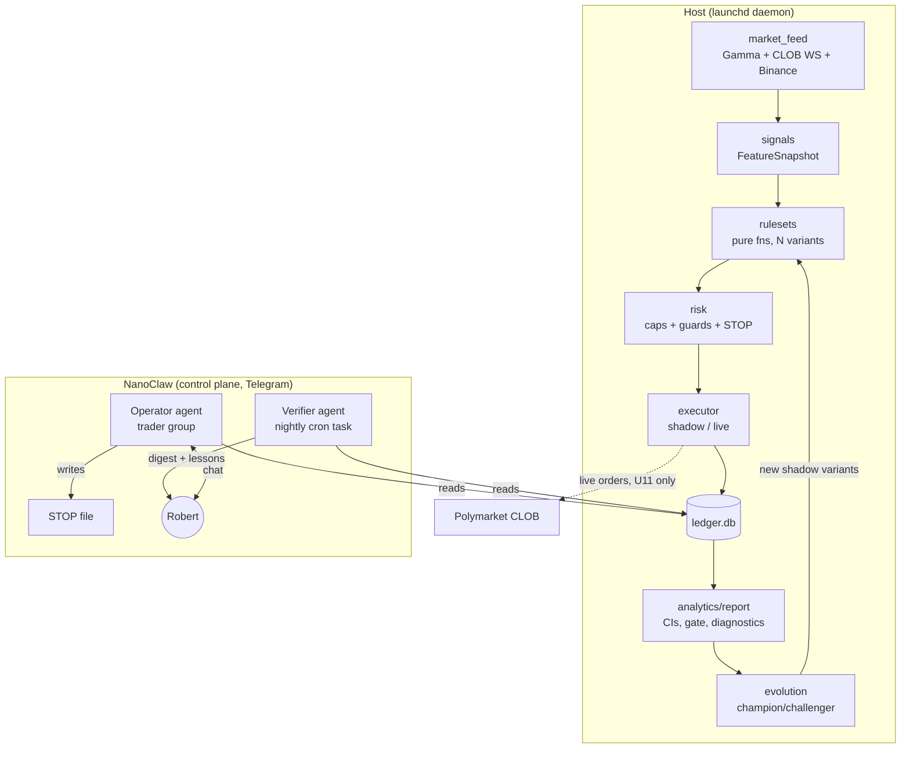

# feat: Evidence-gated Polymarket BTC 5m trading system with NanoClaw control plane

## Overview

Build the "I Am Not A Trader, Bot" system from the approved design spec: a
deterministic Python trading engine for Polymarket BTC 5-minute Up/Down
markets that runs three candidate rule-sets in shadow mode, gates real money
behind statistical evidence, evolves parameters via champion/challenger
selection, and is operated through NanoClaw (Telegram) with separated
operator and verifier agent roles.

**Target repos:** primarily this repo (`i-am-not-a-trader-bot`); U10 also
touches the user's NanoClaw fork (noted inline).

---

## Problem Frame

The operator (zero trading experience, statistically literate, $500–1,000
tuition capital) wants actual profit from high-tempo prediction-market
trading without gambling. The system's core job is to cheaply falsify losing
strategies and only fund rule-sets with demonstrated edge. Full rationale in
the origin spec (see origin: docs/superpowers/specs/2026-07-15-trading-system-design.md).

---

## Requirements Trace

- R1. Three-layer architecture: `STRATEGY.md` (English, source of truth) → `config/rulesets.yaml` → deterministic engine; the LLM never makes per-trade decisions.
- R2. Three rule-sets (momentum-follow, contrarian fade, skew filter) run head-to-head in shadow mode against live markets.
- R3. Shadow fills are pessimistic (ask + one tick) and deduct per-market taker fees read from the API.
- R4. Funding gate: ≥100 shadow trades AND 95% CI lower bound on per-trade EV > 0, evaluated only at pre-registered checkpoints (n = 100, 150, 200, …) — never continuously — so sequential peeking cannot inflate the false-funding rate.
- R5. Kill criteria: CI upper bound < 0, or drawdown > 20% of allocation, or 3 consecutive daily-loss-cap hits.
- R6. Sizing: live trades use quarter-Kelly capped at min(2% bankroll, $5); shadow trades always log P&L at a fixed $5 reference stake (Kelly never sizes shadow — a cold-start variant with edge ≤ 0 would size to $0 and generate no evidence, and gate EV must not be a function of the sizing it produced).
- R7. Learning stack: nightly lessons (operator-approved), champion/challenger evolution (one parameter per challenger, shadow-first, gate-checked auto-promotion with delivery-acknowledged veto window), capital-flow selection.
- R8. NanoClaw integration: operator agent + nightly verifier (different prompt, ledger-only view), Telegram chat commands.
- R9. Hard risk caps enforced in engine code: per-trade max, daily loss cap, max trades/day (live trades), **at most one entry per variant per market bucket** (shadow and live), limit orders only, stale-quote/spread/depth guards, API-failure halt, `STOP` kill-switch file.
- R10. Phases: 0 setup → 1 shadow (2 weeks) → 2 $100 validation → 3 scale.
- R11. Testing: unit tests for pure functions, replay tests from recorded data, 48h soak before Phase 1.

---

## Scope Boundaries

- No combinatorial/cross-market arbitrage, market making, copy trading, or multi-venue trading (origin spec, out of scope).
- No LLM-in-the-loop per-trade decisions.
- No web dashboard; NanoClaw chat + generated markdown reports are the only UI.
- No backtesting engine against historical data beyond replay of engine-recorded feeds (shadow mode against live markets is the evidence source).

### Deferred to Follow-Up Work

- Polymarket US venue integration (`polymarket-us-python`, Ed25519 auth): only if venue verification (U11) shows the user's tradable venue is Polymarket US **and** it lists BTC 5m markets. Separate follow-up plan if needed.
- WhatsApp channel support: this NanoClaw fork is Telegram-only.

---

## Context & Research

### Relevant Code and Patterns

- Reference architecture: Novals83/5min-btc-polymarket (SKILL.md + YAML profiles + runner scripts). Its guard set (quote staleness, spread, top-of-book notional, exit-before-sec) informs `engine/risk.py`.
- NanoClaw fork at `~/nanoclaw` (paths below are relative to that repo):
  - Container mounts: `src/container-runner.ts` (`buildVolumeMounts`), security gate `src/mount-security.ts`, allowlist schema `config-examples/mount-allowlist.json`. Allowlist lives at `~/.config/nanoclaw/mount-allowlist.json` — **currently absent, must be created**. Blocked substrings include `token`/`secret` — avoid in mount paths.
  - Skills: `container/skills/*/SKILL.md`, synced to every group on each run (global visibility — description must be narrowly scoped). Pattern to mirror: `container/skills/rep-update/SKILL.md` (operates on `/workspace/extra/...` mounts, validates, commits).
  - Scheduler: `src/task-scheduler.ts` + `schedule_task` MCP tool (`container/agent-runner/src/ipc-mcp-stdio.ts`); supports cron, isolated context, and a bash pre-check `script` that gates whether the LLM wakes (cost control).
  - Messaging: Telegram only; `send_message` MCP tool supports a `sender` field for a distinct "Verifier" identity.
  - **Containers are ephemeral** (≤~30 min, `--rm`): the trading engine cannot live in a container; it must be a host daemon.
  - Secrets: host `.env` is shadowed inside containers; OneCLI injects agent creds. Engine credentials must live outside the mounted repo tree.

### Institutional Learnings

- No `docs/solutions/` exists in this greenfield repo. Relevant cross-project discipline: reps get killed on evidence (Route Mapper, Solar Miner) — the funding/kill gates encode this.

### External References (verified 2026-07, see plan's Sources)

- `py-clob-client` v1 **archived 2026-05-25, orders rejected by V2 exchange** — use `py-clob-client-v2` (PyPI `py_clob_client_v2`). Auth: L1 EOA key (EIP-712, chain 137) derives L2 HMAC creds via `create_or_derive_api_key()`. Order types: GTC/GTD limit; FOK/FAK market (we use GTC only, R9).
- Polymarket US (QCX LLC, CFTC-regulated) is a **separate venue with a separate Ed25519 API** (`docs.polymarket.us`); `py-clob-client-v2` does not work there. Whether it lists BTC 5m markets is unconfirmed. US-user access to the main CLOB is pending CFTC action (filed 2026-04-28, unresolved).
- BTC 5m markets exist on the main venue; slug `btc-updown-5m-{unix_ts}` (UTC 5-min floor). Discovery: public Gamma API (`gamma-api.polymarket.com`, `/markets`, `/events`, no auth) → `conditionId` → `clobTokenIds`.
- Resolution oracle: **Chainlink BTC/USD**; Polymarket RTDS also streams Binance ticks (signal-grade, not resolution-grade). Chainlink RTDS channel needs a sponsored API key — do not depend on it.
- Fees: taker-only, `fee = shares × feeRate × p × (1−p)`, crypto feeRate 0.07 (≈1.8% max at p=0.5). Read per-market (`feesEnabled`, fee object) — never hardcode.
- CLOB market-data REST + WebSocket (`wss://ws-subscriptions-clob.polymarket.com/ws/`) are public for order books; rate limits generous (9,000 req/10s overall).

---

## Key Technical Decisions

- **Engine = host launchd daemon, NanoClaw = control plane.** NanoClaw containers are ephemeral, so the engine runs on the host under launchd; agents interact with it exclusively through runtime files (ledger export, reports, STOP file, control files). This also keeps trading credentials out of agent reach entirely.
- **Two-mount trust boundary: code read-only, `runtime/` read-write.** Agent containers get the repo mounted **read-only** and only the `runtime/` directory mounted **read-write** (two `additionalMounts` entries). An agent must never have filesystem write access to `engine/`, `config/`, or `ops/` — those enforce the hard caps, and a prompt-injected or off-script agent invocation must not be able to rewrite them. Defense in depth: in live mode the daemon refuses to start if tracked engine/config files are dirty vs the last human-reviewed git commit. `STRATEGY.md` is written only by host-side processes (engine control-file processor or the human); agents request lesson appends via control files, never write the rulebook directly.
- **Shadow mode requires zero credentials.** Gamma + CLOB market data are public. Phases 0–1 are therefore unblocked by the US-venue question; live trading (U11) is the only venue-gated work.
- **Signal feed = Binance public ticks; resolution = Chainlink.** The engine measures the BTC impulse from Binance (free, low-latency) while resolution follows Chainlink. The divergence is a modeled risk: features are signal inputs, and shadow outcomes are recorded from actual market resolution, so the mismatch is priced into measured EV automatically.
- **SQLite ledger, append-only, single writer (the engine).** Host-side analytics reads the live WAL database. **Container-side consumers never touch the live db** — SQLite WAL does not work across the Docker Desktop VM file-sharing boundary (shared-memory mapping requirement), so the engine exports `runtime/ledger-export.db` (SQLite backup API) plus a high-water-mark stamp file after each write cycle; the verifier audits the export and the pre-check compares the stamp. Analytics writes its own report artifacts as files.
- **Credentials live outside the repo tree** (e.g. `~/.config/i-am-not-a-trader-bot/env`), because the repo is mounted read-write into agent containers. The daemon loads them at startup; nothing under the repo path ever contains secrets.
- **Python 3.12+, `uv`-managed venv, `pytest`, `ruff`.** Small dependency set: `py_clob_client_v2` (live only), `httpx`, `websockets`, `pyyaml`, `numpy` (bootstrap CI). No heavyweight frameworks.
- **Fees and fills are computed per-market at evaluation time** from API-read fee objects, applied identically in shadow and live paths so shadow EV is comparable to live EV.

---

## Open Questions

### Resolved During Planning

- Can the engine run inside NanoClaw? **No** — ephemeral containers; host daemon instead.
- Which Python client? **`py-clob-client-v2`** (v1 archived and non-functional).
- Are fees knowable? **Yes, per-market via API**; formula confirmed.
- Does shadow mode need API credentials? **No** — public endpoints suffice.
- Does max-trades/day bind shadow? **No — live only**; shadow throughput is bounded by the one-entry-per-bucket invariant, which both fixes the Phase 1 evidence arithmetic (≈288 buckets/day per variant vs a 100-trade gate) and preserves the CI's independence assumption.
- Does Kelly size shadow trades? **No — fixed $5 reference stake in shadow**; Kelly applies only to live execution (breaks the cold-start circularity and keeps gate EV independent of sizing history).

### Deferred to Implementation

- **Which venue can the user legally trade live (main CLOB vs Polymarket US), and does that venue list BTC 5m markets?** Requires checking the user's actual account type and current CFTC status at Phase 2 time (U11 starts with this). Shadow phase is unaffected.
- **Chainlink resolution lag** (oracle write → market settle): undocumented; measure empirically during shadow (ledger records observed resolution timestamps).
- **Shadow fill-model calibration constants** (tick size on BTC 5m CLOB markets — the ask+1-tick model needs the actual increment, which may vary by price range; queue penalty): initial pessimistic model is ask+1 tick; Phase 2's explicit purpose is validating it against real fills.
- **Daily-loss-cap attribution when multiple variants trade the same day:** which variant is charged with a "daily-loss-cap hit" for the 3-consecutive-hits kill criterion — decide when implementing U6 (candidate: charge every variant that contributed a losing live trade that day).
- Exact Telegram digest formatting and verifier prompt wording: tuned during U10 against NanoClaw's per-channel format rules.

---

## Output Structure

    i-am-not-a-trader-bot/
    ├── STRATEGY.md                  # plain-English rulebook (source of truth)
    ├── config/
    │   └── rulesets.yaml            # machine translation of STRATEGY.md
    ├── engine/
    │   ├── __init__.py
    │   ├── main.py                  # daemon entrypoint + poll loop
    │   ├── market_feed.py           # Gamma discovery, CLOB book, Binance ticks
    │   ├── signals.py               # FeatureSnapshot computation
    │   ├── rulesets.py              # pure decision functions + variant loading
    │   ├── risk.py                  # hard caps, guards, STOP file
    │   ├── executor.py              # shadow + live execution paths
    │   ├── ledger.py                # SQLite schema + append/read API
    │   └── evolution.py             # champion/challenger manager
    ├── analytics/
    │   └── report.py                # stats, diagnostics, funding gate, reports
    ├── ops/
    │   ├── traderctl                # start/stop/status/report CLI wrapper
    │   └── com.iamnotatrader.engine.plist  # launchd unit
    ├── runtime/                     # gitignored: ledger.db, reports/, STOP, logs
    ├── skills/trader/SKILL.md       # NanoClaw operator skill (synced to ~/nanoclaw)
    └── tests/
        ├── test_rulesets.py
        ├── test_risk.py
        ├── test_ledger.py
        ├── test_signals.py
        ├── test_analytics.py
        ├── test_evolution.py
        ├── test_executor.py
        └── replay/                  # recorded feed fixtures + replay harness

---

## High-Level Technical Design

> *This illustrates the intended approach and is directional guidance for
> review, not implementation specification.*

Data flow: one poll-loop tick fetches market state, computes a
`FeatureSnapshot`, evaluates every active variant, passes intents through
risk checks, executes (shadow-log or live order), and appends everything —
including skips with reasons — to the ledger. Analytics and evolution run on
schedules (post-resolution and weekly), never inside the hot loop.

---

## Implementation Units

### Phase A — Engine core (shadow-capable)

- [ ] U1. **Scaffolding, STRATEGY.md, and config schema**

**Goal:** Repo skeleton, tooling, the plain-English rulebook, and its YAML translation with schema validation.

**Requirements:** R1

**Dependencies:** None

**Files:**
- Create: `pyproject.toml`, `.gitignore`, `STRATEGY.md`, `config/rulesets.yaml`, `engine/__init__.py`, `engine/config.py` (loader + validator)
- Test: `tests/test_config.py`

**Approach:**
- `STRATEGY.md` sections: Strategy Hypotheses (one per rule-set, prose), Risk Rules, Sizing Rules, Lessons Learned (append-only log). Write the initial content from the origin spec's rule-set and risk definitions.
- `config/rulesets.yaml`: per-variant blocks (id, ruleset, params, status: shadow|live|retired, allocation), plus global risk caps. Loader validates types/ranges and rejects unknown keys.
- Consistency rule from R1 (English wins) is enforced socially + by verifier audits, not by parsing prose; the config carries a `strategy_md_version` hash field so drift is detectable (hash covers the rules sections only, not the Lessons log, to avoid alarm fatigue on routine lesson appends).
- `STRATEGY.md` is host-write-only: approved lessons and promotion prose blocks are appended by the engine's control-file processor (agents drop approval/notice files in `runtime/control/`; the engine performs the actual write and hash update atomically). Every evolution-created variant that reaches live status must have a plain-English description block in `STRATEGY.md` — the rulebook must always describe what is actually trading.
- `runtime/` gitignored; explicit comment that secrets never live in-repo.

**Test scenarios:**
- Happy path: valid YAML loads into typed config with all three seed variants.
- Error path: unknown key, out-of-range cap (e.g. per-trade stake > hard max), missing required field → loader raises with a message naming the offending field.
- Edge case: variant with `status: retired` loads but is excluded from active set.

**Verification:** `pytest` green; `ruff` clean; a fresh clone + `uv sync` + config load succeeds.

---

- [ ] U2. **Ledger (SQLite, append-only)**

**Goal:** The single source of record for every evaluation, decision, order, fill, and resolution, attributable per variant.

**Requirements:** R3, R4, R11 (falsifiability of all claims)

**Dependencies:** U1

**Files:**
- Create: `engine/ledger.py`
- Test: `tests/test_ledger.py`

**Approach:**
- Tables: `evaluations` (every tick × variant: features snapshot JSON, decision, skip_reason), `trades` (shadow + live: variant_id, market_slug, side, intended/filled price, size, fees, mode), `resolutions` (market outcome, resolved price source timestamps), `risk_events` (guard trips, halts, STOP), `variants` (id, params JSON, lineage, status changes).
- Append-only discipline: no UPDATE on trades/evaluations; status transitions are new rows in `variants`.
- Single-writer: engine process only. WAL mode for host-side concurrent reads.
- Container-side consumers read `runtime/ledger-export.db` (written via SQLite backup API after each write cycle) plus `runtime/ledger-export.stamp` (row-count high-water mark) — never the live WAL db (see Key Technical Decisions: Docker VM boundary).
- Resolutions table includes terminal statuses beyond win/loss: `voided` and `unresolved_timeout` (oracle delay / cancelled market), so permanently-open positions cannot pollute the open-position view or undercount gate n.
- Provide typed read API used by analytics and by agents (via `traderctl report` output rather than raw SQL).

**Test scenarios:**
- Happy path: write evaluation → trade → resolution; join yields correct per-variant P&L including fee.
- Edge case: same market evaluated by 3 variants → 3 evaluation rows, attribution intact.
- Edge case: trade with no resolution yet → excluded from realized P&L, present in open-position view.
- Error path: attempt to update an existing trade row → API refuses (no such method; direct guard test on the module's public surface).
- Integration: concurrent reader (second connection) sees committed rows during writer activity (WAL).
- Happy path: export cycle produces a consistent `ledger-export.db` + stamp whose row counts match the live db at export time.
- Edge case: resolution poll timeout → trade transitions to `unresolved_timeout`, excluded from gate statistics, risk_event logged.

**Verification:** Schema migrations idempotent; ledger survives kill -9 mid-write (SQLite atomicity) in a crash-simulation test.

---

- [ ] U3. **Market data layer**

**Goal:** Reliable, staleness-aware market state: current/next 5m market discovery, CLOB order book, Binance BTC ticks, per-market fee object.

**Requirements:** R2, R3, R9 (staleness guards need timestamps)

**Dependencies:** U1

**Files:**
- Create: `engine/market_feed.py`
- Test: `tests/test_market_feed.py`, `tests/replay/fixtures/` (recorded API responses)

**Approach:**
- Slug construction: `btc-updown-5m-{unix_ts}` from UTC 5-minute floor; resolve via Gamma to `conditionId` + `clobTokenIds`; cache per bucket.
- Order book via CLOB WebSocket (`market` channel) with REST snapshot fallback; track `last_update_ts` per token for staleness.
- BTC spot via Binance public market data — primary endpoints `data-api.binance.vision` (REST) and the corresponding public WS market-data host, with `api.binance.com` as fallback (binance.com is ToS/geo-restricted for US IPs and enforcement varies; the .vision host is Binance's published unauthenticated market-data endpoint). Record interval-open price per 5m bucket to compute the impulse feature. Polymarket RTDS Binance ticks are a secondary source if needed.
- Fee object fetched per market and attached to market state; `feesEnabled` respected.
- All network calls behind one interface so replay tests can inject fixtures; every payload persisted to a rotating capture log (source data for replay tests, R11).

**Test scenarios:**
- Happy path: fixture Gamma response → correct slug→tokenIds resolution for a known bucket timestamp.
- Edge case: bucket boundary (ts exactly on 5-min line) → current vs next market chosen correctly.
- Edge case: WebSocket gap > staleness threshold → state flagged stale (guard consumes this in U6).
- Error path: Gamma 404 for not-yet-created market → returns "no market" cleanly, no crash.
- Error path: malformed/partial book payload → rejected, last good state retained with stale timestamp.
- Integration: replay of a recorded 10-minute capture reproduces identical FeatureSnapshot sequence (with U4).

**Verification:** A live smoke run (read-only, no auth) prints the current market, book top, BTC price, and fee rate.

---

- [ ] U4. **Signals / FeatureSnapshot**

**Goal:** Deterministic feature computation per tick: seconds-to-close, BTC move in interval, skew, spread, top-of-book depth, staleness flags.

**Requirements:** R2

**Dependencies:** U3

**Files:**
- Create: `engine/signals.py`
- Test: `tests/test_signals.py`

**Approach:**
- Pure function: market state + spot state + clock → frozen `FeatureSnapshot` dataclass. No I/O.
- Skew defined as resting-notional imbalance (bid/ask depth ratio across both outcome tokens), distinct from price.
- Snapshot serializes to JSON for the ledger's `evaluations` rows (replayability).

**Test scenarios:**
- Happy path: synthetic book + ticks → hand-computed expected features match exactly.
- Edge case: empty book side → depth 0, skew defined (no div-by-zero), snapshot flagged thin.
- Edge case: no interval-open price yet (engine started mid-bucket) → impulse feature marked unavailable; rule-sets must skip (tested in U5).
- Error path: stale inputs propagate staleness flags into the snapshot.

**Verification:** Same inputs always produce byte-identical serialized snapshots.

---

- [ ] U5. **Rule-sets (three pure decision functions + variants)**

**Goal:** Momentum-follow, contrarian fade, and skew filter as pure functions of (FeatureSnapshot, variant params) → decision (enter side @ limit price / skip with reason).

**Requirements:** R1, R2, R7 (variants are the evolution substrate)

**Dependencies:** U1, U4

**Files:**
- Create: `engine/rulesets.py`
- Modify: `config/rulesets.yaml` (seed the three variants' params), `STRATEGY.md` (prose must match)
- Test: `tests/test_rulesets.py`

**Approach:**
- Registry pattern: ruleset name → function; variants bind params from config. Decisions carry the machine-readable skip/enter reason for the ledger.
- Momentum-follow params: entry window seconds, min BTC impulse USD, favorite min price. Fade params: entry window, underdog max price, min impulse. Skew params: min notional imbalance ratio, entry window.
- All three refuse to act on snapshots with unavailable/stale critical features (defense in depth ahead of risk module).

**Execution note:** Implement test-first — these functions are the easiest place in the system to lock exact intended behavior before wiring anything.

**Test scenarios (per rule-set):**
- Happy path: canonical entry conditions → correct side and limit price.
- Edge case: each threshold at exact boundary (impulse = min, price = threshold, window edge) → documented inclusive/exclusive behavior.
- Edge case: both sides simultaneously qualify (momentum) → stronger side chosen, tie behavior defined.
- Error path: stale/unavailable features → skip with the specific reason code.
- Cross-variant: same snapshot, two variants of one ruleset with different params → independent, correctly-attributed decisions.

**Verification:** Property check: functions are pure (no I/O imports); 100% branch coverage on decision logic.

---

- [ ] U6. **Risk containment module**

**Goal:** Hard caps and guards that no upstream code path can bypass: per-trade max, daily loss cap, max trades/day, spread/depth/staleness guards, consecutive-API-failure halt, STOP file.

**Requirements:** R9, R5 (defund triggers), R6 (sizing clamp)

**Dependencies:** U1, U2

**Files:**
- Create: `engine/risk.py`
- Test: `tests/test_risk.py`

**Approach:**
- Single choke point: `risk.check(intent, ledger_state, market_state) → Approved(sized) | Rejected(reason)`. The executor accepts only `Approved` objects (type-enforced).
- **One-entry-per-bucket invariant:** at most one trade per (variant, market bucket), shadow and live, enforced from ledger state. Entry conditions persist across 2–5s ticks; without this invariant one qualifying bucket floods the ledger with correlated pseudo-trades (destroying the gate's independence assumption) or stacks live positions / burns the daily cap inside one market.
- Sizing inside risk, split by mode: **live** intents get quarter-Kelly from the variant's current edge estimate, clamped to min(2% bankroll, $5) and to live allocation; **shadow** intents are always logged at a fixed $5 reference stake — never Kelly-sized, so cold-start variants generate evidence immediately and gate EV is independent of the sizing history that produced it.
- Max-trades/day cap applies to live trades only; shadow throughput is bounded by the one-entry-per-bucket invariant instead (≈288 buckets/day available per variant), which is what makes the Phase 1 evidence arithmetic work.
- Daily loss computed from ledger (realized, live trades) against calendar-day boundary in the operator's timezone; halt writes a `risk_events` row.
- STOP file check + consecutive-failure counter live in the loop wrapper but route through the same module so every halt is ledgered.

**Execution note:** Test-first; this module is the system's safety case.

**Test scenarios:**
- Happy path: valid intent within all caps → Approved with quarter-Kelly size.
- Edge case: daily realized loss exactly at cap → next intent Rejected; day rollover re-arms.
- Edge case: 20th live trade of day approved, 21st rejected; shadow intents unaffected by the daily cap.
- Edge case: second intent from the same variant in the same bucket → Rejected (one-entry-per-bucket), shadow and live.
- Edge case: live Kelly formula with edge ≤ 0 → size 0 (never negative/short); same variant's shadow intent still logs at the $5 reference stake.
- Happy path: brand-new variant with zero history → shadow intent approved at $5 reference stake (cold-start must produce evidence).
- Error path: spread > guard, depth < guard, stale quote → each rejected with distinct reason codes.
- Error path: STOP file present → everything rejected; removal re-enables without restart.
- Integration: 3 consecutive simulated API failures → engine-halt event ledgered; 2 failures + success → counter resets.

**Verification:** Adversarial test: no public code path constructs an executable order without passing `risk.check`.

---

- [ ] U7. **Shadow engine loop + daemon packaging**

**Goal:** The long-running poll loop tying U2–U6 together in shadow mode, plus launchd packaging and the `traderctl` ops wrapper.

**Requirements:** R2, R3, R10 (Phase 1), R11 (soak)

**Dependencies:** U2, U3, U4, U5, U6

**Files:**
- Create: `engine/main.py`, `engine/executor.py`, `ops/traderctl`, `ops/com.iamnotatrader.engine.plist`
- Test: `tests/test_executor.py`, `tests/replay/test_replay_loop.py`

**Approach:**
- Loop cadence ~2–5s inside each market's active window; sleep-until-next-bucket outside windows. Every tick: snapshot → evaluate all active variants → risk → shadow-execute → ledger.
- Shadow fill model: fill at best ask + 1 tick at decision time; fee from the market's fee object; resolution recorded when the market resolves (poll Gamma/CLOB post-close, with a timeout that transitions unresolved buckets to `unresolved_timeout` and a risk_event). Unfilled-at-that-price scenarios are Phase 2 calibration territory (deferred, see Open Questions).
- `traderctl`: start/stop/status/logs/report/stop-trading (writes STOP). launchd plist: KeepAlive, log paths under `runtime/logs/`.
- Structured logging (JSON lines) — the verifier and replay tests consume these. **Logging contract:** never log raw HMAC secrets, private keys, EIP-712 signatures, or full auth headers — only order metadata (token id, price, size, status). `runtime/logs/` is agent-readable by design, so a leaked credential in a log line defeats the credential-isolation decision. Unit test asserts no credential-shaped strings appear in emitted log lines.

**Test scenarios:**
- Integration: replayed 30-minute capture through the full loop (dry) → deterministic ledger contents; run twice, identical results.
- Happy path: one synthetic market cycle end-to-end → evaluation, shadow trade, resolution, P&L rows all present and consistent.
- Edge case: engine restart mid-bucket → no duplicate trades for the bucket (trade idempotence key: bucket + variant, which the one-entry-per-bucket invariant enforces; evaluations may re-log, trades may not).
- Error path: feed outage mid-window → guards skip, engine survives, resumes next bucket.
- Error path: STOP created mid-loop → loop parks within one tick, status shows stopped-by-switch.

**Verification:** 48-hour soak on the host (R11): no crashes, no unbounded memory/log growth, ledger row counts match expected bucket math. Before the soak, confirm the host cannot sleep (`pmset -g` check; disable sleep or wrap in `caffeinate -s`) — launchd KeepAlive restarts crashes but does not prevent sleep, which would pause engine, NanoClaw, and watchdog simultaneously.

### Phase B — Evidence and learning

- [ ] U8. **Analytics, diagnostics, funding gate**

**Goal:** Per-variant statistics with confidence intervals, the five gambling-vs-trading diagnostics, the funding/kill gate checks, and machine+human readable reports.

**Requirements:** R4, R5, R11; five diagnostics from origin spec

**Dependencies:** U2 (reads ledger only)

**Files:**
- Create: `analytics/report.py`
- Test: `tests/test_analytics.py`

**Approach:**
- Stats per variant: n, mean P&L/trade at the $5 reference stake with bootstrap 95% CI (numpy, fixed seed for reproducibility), Wilson win-rate interval, max drawdown, fee totals.
- Gate functions: `is_fundable(variant)` (R4) and `should_kill(variant)` (R5) — pure, ledger-derived, unit-tested against hand-built ledgers. **Checkpoint discipline:** `is_fundable` evaluates only at pre-registered sample sizes (n = 100, 150, 200, …); between checkpoints it returns the last checkpoint's verdict. Reports regenerate freely, but the gate decision is a step function of n — continuous evaluation would let a zero-edge variant get funded on any lucky streak that momentarily clears the CI bound (optional-stopping inflation).
- Paired comparison function for champion-vs-challenger retirement (consumed by U9): CI on per-market P&L difference restricted to buckets both variants evaluated concurrently — the only comparison that controls for market regime.
- Diagnostics: exit-before-resolution rate, median hold time, size–edge correlation, limit-order %, profit-source attribution.
- Outputs: `runtime/reports/latest.json` (agents parse this) and `runtime/reports/latest.md` (humans read this); regenerated post-resolution and on demand via `traderctl report`.

**Test scenarios:**
- Happy path: synthetic ledger with known outcomes → hand-computed mean, CI coverage, drawdown match.
- Edge case: n=99 with stellar record → not fundable (gate requires ≥100); n=100 marginal → gate decided strictly by CI lower bound sign.
- Edge case: variant clears the CI bound transiently at n=123 but not at checkpoints n=100 or n=150 → never fundable (checkpoint discipline).
- Happy path: paired comparison on a synthetic ledger where the champion's pre-challenger era is strong but the overlapping window favors the challenger → challenger wins the paired test (regime control works).
- Edge case: variant with zero trades → report renders, gates return not-fundable/not-killable without errors.
- Edge case: all-wins ledger → Wilson interval sane (no division issues), bootstrap CI degenerate-but-defined.
- Error path: ledger locked/corrupt → report fails loudly, never emits stale data as fresh (staleness stamp in output).

**Verification:** Reports reproducible: same ledger + same seed → byte-identical JSON.

---

- [ ] U9. **Champion/challenger evolution**

**Goal:** Weekly (per ~100 trades) proposal of single-parameter challenger variants backed by a statistical case; shadow spawning; gate-checked promotion with veto window; champion retirement.

**Requirements:** R7

**Dependencies:** U5, U8

**Files:**
- Create: `engine/evolution.py`
- Modify: `config/rulesets.yaml` (evolution writes new variant blocks), `engine/main.py` (schedule hook)
- Test: `tests/test_evolution.py`

**Approach:**
- Proposal generation: scan ledger for parameter-conditional performance splits (e.g. bucketed entry-time performance); a proposal requires the effect's CI to clear a minimum threshold — noise-level splits are explicitly rejected and logged as such.
- One parameter per challenger, enforced structurally (challenger = champion params + single diff, recorded as lineage in `variants`).
- Promotion: challenger passes R4 gate → status flips to `pending_promotion`, veto notice file written for the operator agent to deliver (U10). **The 24h veto clock starts only after a delivery acknowledgment appears** (the operator agent writes a notice-delivered marker after `send_message` succeeds). No acknowledgment → hold in `pending_promotion` and escalate via the verifier digest; never promote on an undelivered notice — fail-closed, not fail-open, because promotion moves real capital. Live champions' params frozen (config loader from U1 rejects param edits to `status: live` variants).
- Promotion writes prose: the transition generates a plain-English variant description (parameter changed, statistical case, lineage) delivered as a control file that the engine's processor appends to `STRATEGY.md` — an evolved variant may never trade live without the rulebook describing it (R1).
- Retirement: champion beaten by promoted challenger **on the paired overlapping-window comparison from U8** (never full-history CIs, which reward whichever variant sampled the friendlier regime) → `retired` row; capital reallocation is just the allocation field moving.

**Test scenarios:**
- Happy path: synthetic ledger with a genuine planted effect → exactly one challenger proposed, correct single param changed, lineage recorded.
- Edge case: noisy ledger with no real effect → zero proposals (anti-superstition test; seeded random ledgers must not generate proposals more than the configured false-positive rate).
- Edge case: challenger passes gate → pending_promotion + veto notice; veto file present → promotion cancelled and ledgered.
- Error path: veto notice written but no delivery acknowledgment within deadline → variant stays pending_promotion indefinitely, escalation appears in verifier digest, no promotion.
- Happy path: promotion transition emits the plain-English STRATEGY.md block with param diff, statistical case, and lineage.
- Error path: attempt to mutate a live variant's params via config edit → loader rejects (frozen-while-live rule).
- Integration: full cycle on synthetic data: propose → shadow → gate → promote → retire champion, all transitions in `variants` history.

**Verification:** Every variant's full lineage reconstructible from the ledger alone.

### Phase C — Control plane

- [ ] U10. **NanoClaw integration (operator group, trader skill, nightly verifier)**

**Goal:** Telegram-operated control plane: operator agent group with the repo mounted, `trader` skill, nightly verifier scheduled task with cheap pre-check, distinct sender identities.

**Requirements:** R8, R7 (lessons + veto delivery), R10

**Dependencies:** U7, U8 (consumes reports/ledger/STOP conventions)

**Files (this repo):**
- Create: `skills/trader/SKILL.md`, `ops/verifier-precheck.sh`, `docs/nanoclaw-setup.md`
**Files (target repo: user's `nanoclaw` fork — cross-repo unit):**
- Create: `container/skills/trader/SKILL.md` (synced copy; document the sync direction in `docs/nanoclaw-setup.md`)
- Modify: `~/.config/nanoclaw/mount-allowlist.json` (create — currently absent; `nonMainReadOnly: false`), `registered_groups` DB row for the new `telegram_trader` group (containerConfig with two mounts: repo read-only at `/workspace/extra/trader-bot`, `runtime/` read-write at `/workspace/extra/trader-runtime`)

**Approach:**
- Skill teaches: `trader status|report|fund <variant> $<amt>|kill <variant>|stop` — each maps to reading `runtime/reports/latest.*` or writing control files (STOP, allocation-change requests) in the runtime mount; the engine polls control files so agents never touch the process directly. Frontmatter description narrowly scoped ("only in the trader group context") since skills are globally visible.
- **Two mounts, split by trust (see Key Technical Decisions):** repo root mounted read-only at `/workspace/extra/trader-bot`; `runtime/` mounted read-write at `/workspace/extra/trader-runtime`. Mount paths avoid blocked substrings (`token`, `secret`).
- **The allowlist must set `"nonMainReadOnly": false` and the runtime mount must set `readonly: false`** — NanoClaw's `src/mount-security.ts` `validateMount()` forces read-only for every non-main group whenever `nonMainReadOnly` is true, regardless of the root's `allowReadWrite`, and the template default is true. Without this, STOP-via-chat and all control-file writes fail silently as a read-only mount. Accepted tradeoff (documented in `docs/nanoclaw-setup.md`): this loosens the global read-only clamp for all non-main groups on this instance — mitigate by keeping every other allowlist root `allowReadWrite: false`, and by the fact that only `runtime/` (no code) is requested read-write. Setup verification step: touch a file in the runtime mount from inside the container before running the STOP round-trip test.
- Group registered via main agent's `register_group`, then containerConfig added to the DB row (documented step-by-step in `docs/nanoclaw-setup.md` because parts are manual/one-time).
- Verifier: `schedule_task` cron `0 2 * * *`, isolated context, prompt = audit the ledger export vs `STRATEGY.md` (rule violations, guard trips, anomalies, pending veto notices, undelivered promotion notices), output = Telegram digest via `send_message` with `sender: "Verifier"`.
- **Pre-check `ops/verifier-precheck.sh` wakes the LLM on EITHER condition:** new rows in the export stamp since last digest, OR zero new rows during a window when the engine should have been evaluating (dead/hung-engine alarm — the original "new rows only" formulation silences exactly the failure it exists to catch; launchd KeepAlive covers crashes but not hangs). While live capital is deployed, an additional hourly cron runs the liveness half only, alerting via a direct bash Telegram send (no LLM wake) so detection latency is ≤1h, not ≤24h.
- Lessons: verifier drafts to `runtime/proposed-lessons/`, operator relays for approval, and on approval the operator agent writes an approved-lesson control file to `runtime/control/`; the engine's host-side processor performs the actual `STRATEGY.md` append (agents never write the rulebook — repo mount is read-only).

**Test scenarios:**
- Happy path: skill dry-run in a container — `trader status` reads a fixture report and renders Telegram-format output (single-asterisk bold, no `##`, per NanoClaw channel rules).
- Integration: STOP written via chat command → engine (running against the same tree) parks within one tick.
- Integration: pre-check with no new export-stamp rows AND engine expected idle → `wakeAgent:false` (verifier LLM not invoked); with new rows → `wakeAgent:true` and digest arrives; with zero rows during expected-active hours → `wakeAgent:true` with dead-engine context (alarm case).
- Integration: write access confirmed in the runtime mount, and write to the read-only repo mount fails from inside the container (trust boundary holds).
- Error path: mount misconfigured/absent → skill instructs agent to report the setup failure rather than hallucinate state.
- Edge case: veto notice pending → both nightly digest and `trader status` surface it prominently.

**Verification:** End-to-end rehearsal on the host: send `trader status` in Telegram, receive real report; verifier fires at scheduled time and delivers digest.

### Phase D — Live trading (venue-gated)

- [ ] U11. **Venue verification + live executor**

**Goal:** Determine the legally/practically tradable venue for the user's account; if main-CLOB access is available, implement the live execution path with `py-clob-client-v2`; wire Phase 2 validation.

**Requirements:** R6, R9, R10 (Phases 2–3), R3 (fill-model validation)

**Dependencies:** U7 (executor interface), U6 (risk), U8 (gate decides who trades)

**Files:**
- Create: `engine/live_client.py`, `docs/phase2-runbook.md`
- Modify: `engine/executor.py` (live path behind explicit mode flag), `ops/traderctl` (`go-live` subcommand requiring typed confirmation)
- Test: `tests/test_live_client.py` (mocked client; no live orders in CI)

**Approach:**
- **Step 1 is a decision gate, not code:** verify the user's account venue (main CLOB vs Polymarket US), current CFTC/US-access status, and 5m-market availability on that venue. If main CLOB is not available to the user, STOP — write findings to `docs/phase2-runbook.md` and raise the Polymarket-US follow-up (see Scope Boundaries) rather than integrating a venue the plan hasn't vetted.
- If cleared: L1 key from `~/.config/i-am-not-a-trader-bot/env` (outside repo tree), derive L2 creds at startup (`create_or_derive_api_key()`), GTC limit orders only, order lifecycle (place → poll fills → cancel at exit-before-sec) recorded to ledger with real fill prices/fees.
- **Live-mode startup reconciliation:** query open orders via the client, reconcile against ledger rows with no terminal state, cancel any resting order whose market window is past exit-before-sec, and ledger the reconciliation as a risk_event. Without this, a crash between place and cancel leaves an orphaned GTC order that can fill in the final seconds and ride to resolution untracked.
- Live mode requires: variant `status: live` in config AND funding-gate pass recorded AND `traderctl go-live` confirmation — three independent switches. Live mode also refuses to start if tracked `engine/`/`config/` files are dirty vs the last human-reviewed commit (integrity check from Key Technical Decisions).
- Phase 2 comparison job: real fills vs shadow fill model, written into reports. The comparison covers **fill rates and non-fill outcomes, not just prices of filled trades** — the dominant shadow-vs-live gap is selective fill (limit orders fill preferentially when the move goes against you). Minimum sample before any Phase 3 scaling decision: **50–100 live trades** (n=20 gives a win-rate standard error of ~11 points and cannot detect the bias this phase exists to measure); the runbook defines the acceptance thresholds, and scaling is gradual rather than a single jump.

**Test scenarios:**
- Happy path (mocked): approved intent → GTC order with correct token ID, price, size; fill recorded with actual fee.
- Error path (mocked): order rejected by exchange → ledgered as failed, counts toward consecutive-failure halt.
- Error path: missing/invalid credentials at startup in live mode → refuse to start (never silently degrade to shadow while flagged live; never trade with partial auth).
- Error path (mocked): crash with resting GTC order → restart reconciliation cancels the orphan and ledgers a risk_event.
- Edge case: exit-before-sec reached with resting unfilled order → cancel confirmed before window close, cancellation ledgered; the non-fill outcome recorded for the fill-rate comparison.
- Integration (manual, Phase 2 runbook): first $1–5 real order placed and reconciled against ledger and Polymarket UI.

**Verification:** Runbook executed with real $100 allocation only after gate pass; shadow-vs-real fill report (fill rates + prices + non-fill outcomes) generated over the first 50–100 live trades before any Phase 3 scaling decision.

---

## System-Wide Impact

- **Interaction graph:** engine (writer) / agents + analytics (readers) meet only at `runtime/` files — ledger export + stamp (containers), live WAL db (host-side analytics only), reports, STOP, control files, veto notices. Agent containers mount code read-only and `runtime/` read-write. No sockets, no shared process state.
- **Error propagation:** feed errors → staleness flags → guard skips (never trades on bad data); executor errors → risk_events + failure counter → halt; agent-side failures degrade to "report setup problem," never to invented state.
- **State lifecycle risks:** engine restart idempotence (U7), append-only ledger (U2), frozen-while-live params (U9), day-boundary re-arming of loss caps (U6).
- **API surface parity:** `traderctl` and the NanoClaw skill expose the same operations; anything added to one must be added to both (they share the control-file mechanism, so parity is structural).
- **Integration coverage:** replay loop test (U7), STOP round-trip via chat (U10), promote/retire cycle (U9), live order lifecycle mocked (U11).
- **Unchanged invariants:** the NanoClaw fork's core (`src/`) is not modified — integration uses only its existing extension points (skills dir, mount allowlist, group registration, schedule_task).

---

## Risks & Dependencies

| Risk | Mitigation |
|------|------------|
| US venue question blocks live trading entirely | Shadow phase needs no venue; U11 opens with an explicit go/no-go gate; Polymarket-US integration pre-scoped as follow-up |
| Shadow fill model too optimistic → funded strategy underperforms | Pessimistic ask+1-tick model; Phase 2's $100 exists specifically to measure model-vs-real gap before scaling |
| All three rule-sets fail the gate (likely) | Explicitly acceptable per origin spec; infrastructure + evolution loop are the durable assets; cost ≈ $0 |
| Binance signal vs Chainlink resolution divergence | Divergence lands in measured shadow EV automatically; noted for verifier attention in early digests |
| Polymarket changes fees/market structure silently | Fees read per-market at evaluation time; verifier digest flags fee-rate changes day-over-day |
| Engine daemon dies silently | launchd KeepAlive (crashes); pre-check dead-engine alarm wakes the verifier on zero-rows-during-active-hours (hangs); hourly bash-only liveness alert while live capital deployed |
| Agent misreads/miswrites control files | Agents restricted to documented control-file formats in SKILL.md; engine validates and ledgers every control-file action; STOP is fail-safe (halts, never starts, trading) |
| Prompt-injected/off-script agent rewrites engine or config code | Code mounted read-only in agent containers (only `runtime/` is writable); live mode refuses to start on dirty tracked engine/config files |
| `py-clob-client-v2` churn (v1 was archived abruptly) | Live client isolated in `engine/live_client.py` behind the executor interface; version pinned |

---

## Documentation / Operational Notes

- `docs/nanoclaw-setup.md`: one-time manual steps (mount allowlist creation, group registration, DB row containerConfig, skill sync direction).
- `docs/phase2-runbook.md`: venue verification findings, go-live checklist, fill-model acceptance criteria.
- `README.md`: update from placeholder to system overview + traderctl usage (after U7).
- Monitoring: launchd KeepAlive + verifier liveness alert (no-new-rows check) are the two watchdogs; no external monitoring stack.

---

## Sources & References

- **Origin document:** [docs/superpowers/specs/2026-07-15-trading-system-design.md](../superpowers/specs/2026-07-15-trading-system-design.md)
- Reference architecture: https://github.com/Novals83/5min-btc-polymarket
- NanoClaw fork internals (researched 2026-07-15): `src/container-runner.ts`, `src/mount-security.ts`, `src/task-scheduler.ts`, `container/agent-runner/src/ipc-mcp-stdio.ts`, `container/skills/rep-update/SKILL.md`
- Polymarket docs: fees (docs.polymarket.com/trading/fees), rate limits (docs.polymarket.com/api-reference/rate-limits), Gamma API (docs.polymarket.com/developers/gamma-markets-api/overview), RTDS crypto prices
- Clients: https://github.com/Polymarket/py-clob-client-v2 (current), https://github.com/Polymarket/py-clob-client (archived 2026-05-25)
- Polymarket US: docs.polymarket.us (separate Ed25519 API); QCX acquisition (PR Newswire 2025-07); US main-CLOB access filing pending (2026-04-28)
- Slug mechanics: dev.to/bluewhale-quant-lab (btc-updown-5m slug format); Chainlink settlement deep-dive (blockeden.xyz forum)
